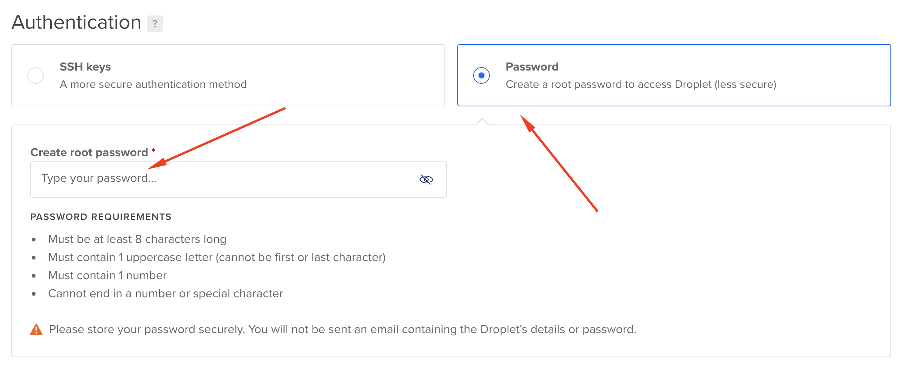

DigitalOcean
========================
**Info:** Віртуальні сервери в DigitalOcean (DO) називають дроплетами (droplets).

1. Заходимо в інтерфейс створення дроплетів (зверху кнопка `Create` та меню `Droplets`).
2. Операційку не обираємо, плейбук написаний під Ubuntu 20.04 (LTS) x64, яка є дефолтною операційкою в DO на теперішній момент.
3. Тип серверів залишаємо Basic.
4. Щоб було трошки дешевше, обираємо в `CPU options` пункт `Regular Intel with SSD`.
5. Обираєте потрібний сервер. Тут потріюно обирати на ваш гаманець. Також від цього вибору буде залежати конфігурація плейбука. Якщо не розумієте, оберіть найдешевший тариф ($5).
6. Обираєте датацентр. Можете створити дроплети в різних ДЦ, для плейбука це не важливо.
7. Аунтифікацію робимо з допомогою логіна та проля. Вказуємо пароль. Цей пароль буде для всіх дроплетів, які будуть зараз створені. Логін - `root`.
8. Обираєте кількість дроплетів, які хочете створити.
9. Для зручності, можете ще назначити цим дроплетам тег(и). Коли багато дроплетів, з тегами зручніше менеджерити їх. Але це по бажанню.
10. Після створення дроплетів ви побачите їх список. Копіюєте IP у файл [hosts](../hosts).

___

